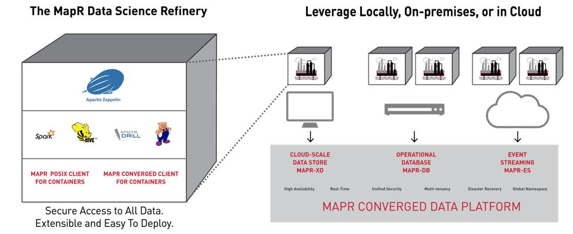

# MapR Data Science Refinery Tutorial
The repository contains examples explain the key features of using MapR Data Science Refinery.

## Contents 

1. [Introducing the MapR Data Science Refinery](https://mapr.com/blog/introducing-mapr-data-science-refinery/)
1. [MapR Data Science Refinery configuration options](doc/tutorials/001-configuration.md)
1. [Zeppelin's interpreters, how to configure and use](doc/tutorials/002-interpreters.md)
1. [Zeppelin's notebooks, accessing and creating](doc/tutorials/003-notebooks-accessing-creating.md)
1. [Visualization in MapR Data Science Refinery](doc/tutorials/004-visualization.md)
1. [Use cases. How to use Data Science Refinery to access the different backend engines](doc/tutorials/005-use-cases.md)
	- [Running Shell Commands](doc/tutorials/0051-shell-commands.md)   
	- [Running Pig Scripts](doc/tutorials/0052-pig-scripts.md)
	- [Running Drill Queries]()
	- [Running Hive Queries](doc/tutorials/0054-running-hive-queries.md)
	- [Running Spark Jobs](doc/tutorials/0055-running-spark-jobs.md)
    - [Running MapR Database Shell Commands](doc/tutorials/0056-running-mapr-db-shell-commands.md)
	- [Accessing MapR Database in Zeppelin Using the MapR Database Binary Connector]()
	- [Accessing MapR Database in Zeppelin Using the MapR Database OJAI Connector]()
	- [Accessing MapR Event Store For Apache Kafka in Zeppelin Using the Livy Interpreter]()    
	- [Accessing MapR Event Store For Apache Kafka in Zeppelin Using the Spark Interpreter]()
1. [How to install custom packages (Tensorflow)](doc/tutorials/006-how-to-install-custom-packages.md)
    - [Training model example]() 
1. [Sharing Zeppelin Notebook](doc/tutorials/007-sharing-zeppelin-notebook.md)
1. [Building your own MapR Data Science Refinery Docker Image](doc/tutorials/008-building-your-own-mdsr-image.md)
1. [Troubleshooting Zeppelin](doc/tutorials/009-troubleshooting-zeppelin.md)
1. [The official MapR Data Science Refinery documentation](https://mapr.com/docs/61/DataScienceRefinery/DataScienceRefineryOverview.html)

### Prerequisites
* MapR Converged Data Platform 6.1 with Apache Hive and Apache Drill or [MapR Container for Developers](https://mapr.com/docs/home/MapRContainerDevelopers/MapRContainerDevelopersOverview.html)
* JDK 8
* All notebooks for the tutorial are located in `/notebooks`

<!--
> If you will run MapR Data Science Refinery from the host you must have MapR Client installed and configured
[Installing and configuring MapR Client](doc/tutorials/mapr-client.md)
-->

### MapR Data Science Refinery Architeture
