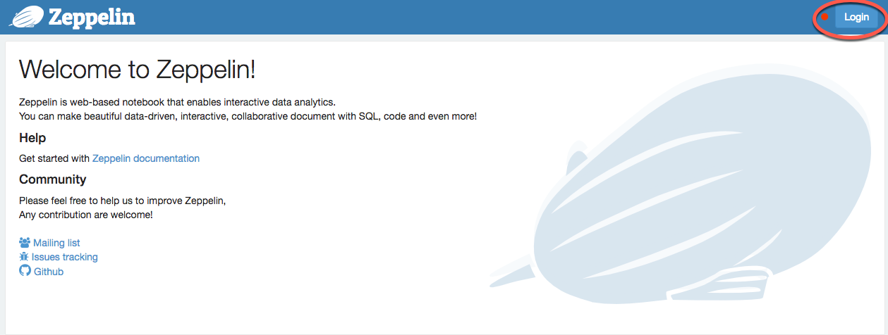
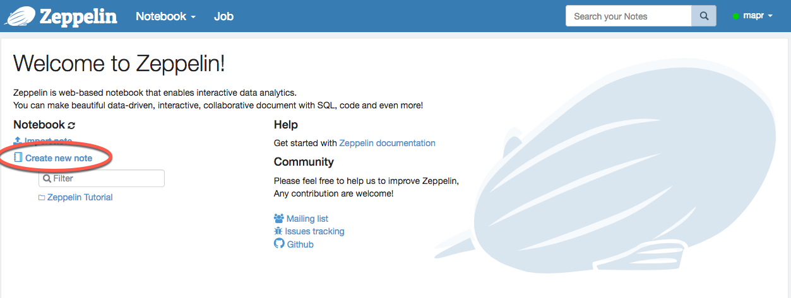

# Zeppelin's notebooks, accessing and creating
1. After the Apache Zeppelin Docker image is running, access the Zeppelin notebook in your browser by specifying the following URL:

```
https://localhost:9996
```

This URL loads the Zeppelin notebook’s home page. You must specify a secure URL.

If the Docker image is running on a remote node, such as a MapR edge node, replace localhost with the host name or IP address of the remote node. If you specified a different port number in your docker run command, replace `9995` with your port number.

2. Log in to Zeppelin using the user name and password you specified in your docker run command:


3. Create your notebook:
