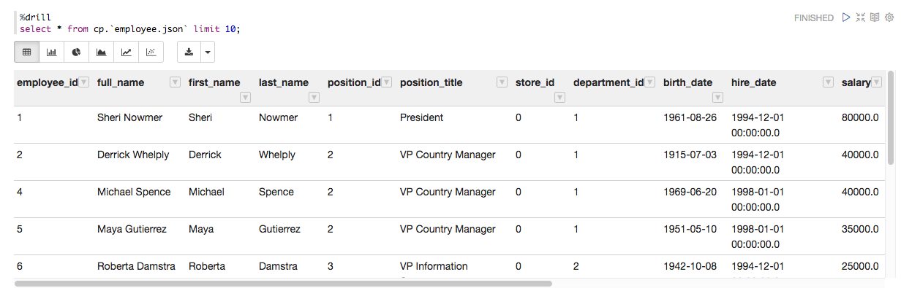

# Running Drill Queries in Zeppelin

This section contains samples of Apache Drill queries that you can run in your Apache Zeppelin notebook.

Before running Drill queries, make sure you have configured the [Drill JDBC interpreter](https://mapr.com/docs/61/Zeppelin/ConfigureJDBCInterpreter.html#concept_b5l_xdk_qbb__section_o3n_c2k_qbb).

[Apache Drill](https://drill.apache.org/) is a schema-free SQL Query Engine for Hadoop, NoSQL and Cloud Storage.


The following example queries a JSON file:

```
%drill
select * from cp.`employee.json` limit 10;
```
The output looks like the following:




About the `employee.json` File. The sample file, `employee.json`, is packaged in the Foodmart data JAR in Drill's classpath:

```
./jars/3rdparty/foodmart-data-json.0.4.jar
```

The file contains fictitious employee data. Here is a snippet of the file:

```
{"employee_id":1,"full_name":"Sheri Nowmer","first_name":"Sheri","last_name":"Nowmer","position_id":1,"position_title":"President","store_id":0,"department_id":1,"birth_date":"1961-08-26","hire_date":"1994-12-01 00:00:00.0","end_date":null,"salary":80000.0000,"supervisor_id":0,"education_level":"Graduate Degree","marital_status":"S","gender":"F","management_role":"Senior Management"}
```