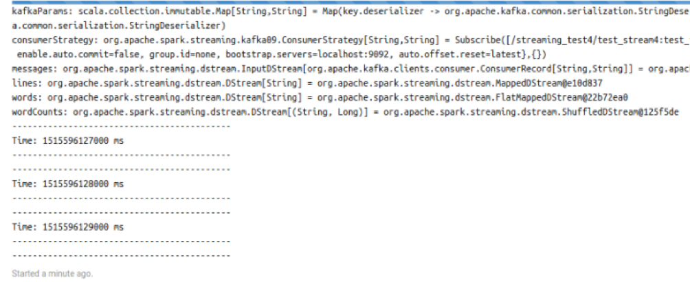
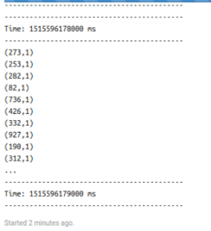

# Accessing MapR Event Store For Apache Kafka in Zeppelin Using the Spark Interpreter

This section contains a MapR Event Store For Apache Kafka streaming example that you can run in your Apache Zeppelin notebook using the Spark interpreter. 

> **Note:** See [MapR Data Science Refinery Support by MapR Core Version](https://mapr.com/docs/61/DataScienceRefinery/DSRSupportByCoreVersion.html) for limitations in version support when accessing MapR Event Store.

[Configure the Spark interpreter](https://mapr.com/docs/61/Zeppelin/ConfigureSparkInterpreter.html#task_t1d_4yj_qbb). Make sure to follow the steps described in the Spark Jobs section to allow Spark jobs to run in parallel.

The example references a stream named `test_stream` created in the path `/streaming_test/test_stream`. The stream contains a topic called `test_topic`. You can use the following commands to create this stream and topic, but you cannot run them in Zeppelin; they must be run in a MapR cluster.

```
hadoop fs -mkdir /streaming_test
hadoop fs -chown <user>:<group> /streaming_test
sudo su - <user>
maprcli stream create -path /streaming_test/test_stream
maprcli stream topic create -path /streaming_test/test_stream -topic test_topic
```

**When the stream and topic are available, perform the following actions in your notebook:**

<details> 
  <summary>Create a streaming consumer in your notebook using the %spark interpreter:</summary>

```
import org.apache.kafka.clients.consumer.ConsumerConfig

import org.apache.spark.SparkConf
import org.apache.spark.streaming.{Seconds, StreamingContext}
import org.apache.spark.streaming.kafka09.{ConsumerStrategies, KafkaUtils, LocationStrategies}        

val ssc = new StreamingContext(sc, Seconds(1))

val topicsSet = Set("/streaming_test/test_stream:test_topic")
val kafkaParams = Map[String, String](
  ConsumerConfig.BOOTSTRAP_SERVERS_CONFIG -> "localhost:9092",
  ConsumerConfig.GROUP_ID_CONFIG -> "none",
  ConsumerConfig.KEY_DESERIALIZER_CLASS_CONFIG ->
    "org.apache.kafka.common.serialization.StringDeserializer",
  ConsumerConfig.VALUE_DESERIALIZER_CLASS_CONFIG ->
    "org.apache.kafka.common.serialization.StringDeserializer",
  ConsumerConfig.AUTO_OFFSET_RESET_CONFIG -> "latest",
  ConsumerConfig.ENABLE_AUTO_COMMIT_CONFIG -> "false"
)

val consumerStrategy =
      ConsumerStrategies.Subscribe[String, String](topicsSet, kafkaParams)
val messages = KafkaUtils.createDirectStream[String, String](
      ssc,
      LocationStrategies.PreferConsistent,
      consumerStrategy)

val lines = messages.map(_.value())
val words = lines.flatMap(_.split(" "))
val wordCounts = words.map(x => (x, 1L)).reduceByKey(_ + _)
wordCounts.print()

ssc.start()
ssc.awaitTermination()
```

</details>

[]()


<details> 
  <summary>Create a streaming producer in another notebook, also with the %spark interpreter:</summary>

```
import java.util.Properties
import org.apache.kafka.clients.producer.{KafkaProducer, ProducerRecord}

val props = new Properties()
props.put("bootstrap.servers", "localhost:9092")
props.put("acks", "all")
props.put("retries", "0")
props.put("batch.size", "16384")
props.put("linger.ms", "1")
props.put("buffer.memory", "33554432")
props.put("key.serializer", "org.apache.kafka.common.serialization.StringSerializer")
props.put("value.serializer", "org.apache.kafka.common.serialization.StringSerializer")

val producer = new KafkaProducer[String, String](props)

for (i <- 1 to 1000) {
    val message = new ProducerRecord[String, String]("/streaming_test/test_stream:test_topic", i.toString(), i.toString())
    producer.send(message)
}
```

</details>

[]()


<details> 
  <summary>Start running the consumer notebook. Wait until this consumer session is initialized and running. The following sample output in your notebook indicates the session is running:</summary>
  


</details> 

[]()


<details> 
  <summary>Run the producer notebook. The consumer notebook displays the following sample output after you run the producer:</summary>
  


</details> 

[]()

The prepared notebooks for this section is ready to be imported to your MapR DSR. 

Click on `Import note:` button and select the JSON file `consumer-event-store-for-kafka-use-spark.json` and `producer-event-store-for-kafka-use-spark.json` or put the links to them. 

<details> 
  <summary>Details</summary>
  


</details> 