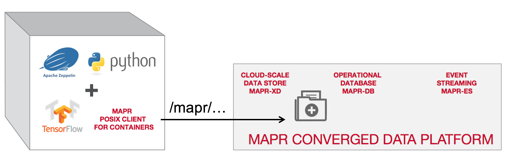
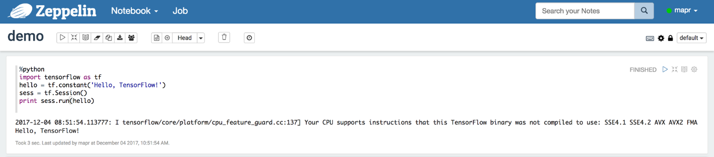

# Installing custom packages

You can install custom Python packages either by manually installing packages on each node in your MapR cluster or by using Conda. Using Conda allows you to perform the install from your Zeppelin host node without having to directly access your MapR cluster. 

You can run only one version of Python in your Zeppelin notebook.

> Important! MapR supports the Python libraries included in the Zeppelin container, but does not support the libraries in custom Python packages. You should use Python versions that match the versions installed on your MapR cluster nodes. Choosing a Zeppelin Docker image OS that matches the OS running in your MapR cluster minimizes library version differences.

[Manually Installing Custom Packages for PySpark](https://mapr.com/docs/61/Zeppelin/ManualInstallPySpark.html)
Use the Python package manager pip (or pip3 for PySpark3) to manually install custom packages on each node in your MapR cluster. You need administrative access on your cluster nodes to install the packages.

[Installing Custom Packages for PySpark Using Conda](https://mapr.com/docs/61/Zeppelin/InstallPySparkCondaV1.1.html)
To install custom packages for Python 2 (or Python 3) using Conda, you must create a custom Conda environment and pass the path of the custom environment in your docker run command.


#### How to install TensorFlow

One of the great advantages of MapR-FS is the ability to mount your global file namespace as a Direct NFS mount on your local file system. What this means for machine learning libraries is that they can interact directly with the data in the cluster without needing to be distributed via an execution engine like Spark or limited by compatibility with HDFS.



The MapR Data Science Refinery container includes a FUSE-based MapR POSIX Client, optimized for containers, that allows deep learning libraries to read and write data directly to MapR-FS.

So, when you run TensorFlow, the compute occurs on the host where the container resides, but each container has full access to the persistent storage provided by the MapR Data Platform. When you kill the container off, the data remains.

In order to install TensorFlow in your Data Science Refinery container, it's as simple as running:
```
sudo -u root pip install tensorflow
```

This is immediately available to you via the Python interpreter in Apache Zeppelin, and you can test it with the following script in a Zeppelin paragraph:

```
%python

import tensorflow as tf
hello = tf.constant('Hello, TensorFlow!')
sess = tf.Session()
print sess.run(hello)
```

You should see the following result:



In order to access TensorBoard, you need to simply add the port mapping to Docker Run as such:

```
docker run -p 6006:6006 …
```

And then launch TensorBoard using the external host IP:

```
tensorboard --logdir /tmp/ --host 0.0.0.0
TensorBoard 1.6.0 at http://0.0.0.0:6006 (Press CTRL+C to quit)
```

>In some cases when launching `tensorboard --logdir /tmp/ --host 0.0.0.0` posible to get the error:

<details> 
  <summary>ImportError: No module named extern</summary>

```
$ tensorboard --logdir /tmp/ --host 0.0.0.0
Traceback (most recent call last):
  File "/bin/tensorboard", line 6, in <module>
    from tensorboard.main import run_main
  File "/usr/lib/python2.7/site-packages/tensorboard/main.py", line 44, in <module>
    from tensorboard import default
  File "/usr/lib/python2.7/site-packages/tensorboard/default.py", line 35, in <module>
    from tensorboard.plugins.audio import audio_plugin
  File "/usr/lib/python2.7/site-packages/tensorboard/plugins/audio/audio_plugin.py", line 25, in <module>
    from tensorboard import plugin_util
  File "/usr/lib/python2.7/site-packages/tensorboard/plugin_util.py", line 24, in <module>
    import markdown
  File "/usr/lib64/python2.7/site-packages/markdown/__init__.py", line 28, in <module>
    from pkg_resources.extern import packaging
ImportError: No module named extern
```

</details>

[]()
To solve this I installed `setuptools` additionally  

```
$ sudo pip install -U setuptools 
```