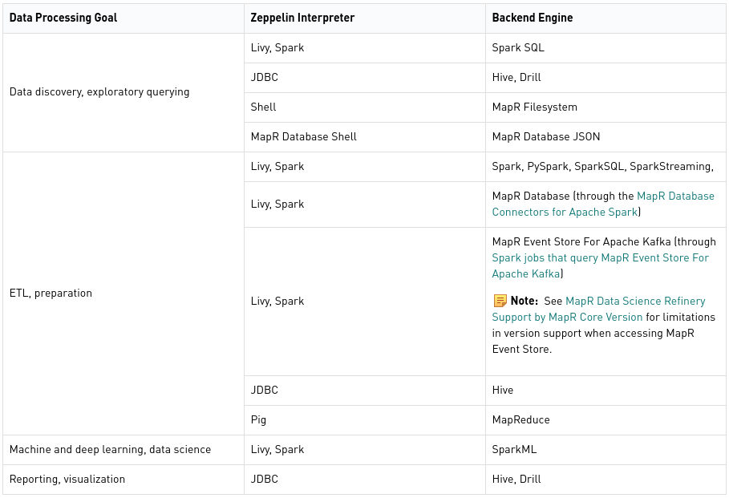
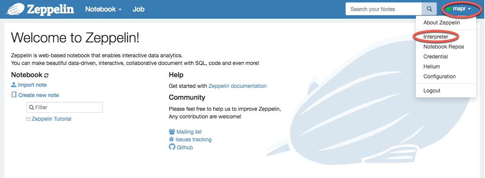

# Zeppelin interpreters on MapR

Apache Zeppelin Interpreter is a plug-in which enables Zeppelin users to use a specific language/data-processing-backend. For example, to use Scala code in Zeppelin, you need `%spark` interpreter.

#### Supported Zeppelin Interpreters

Apache Zeppelin on MapR supports the following interpreters:

- **Shell** With the Shell interpreter, you can invoke system shell commands. If you have a MapR Filesystem mount point, you can access MapR Filesystem using shell commands like ls and cat by using the [FUSE-Based POSIX Client](https://mapr.com/docs/61/Zeppelin/ZeppelinDockerRunParameters.html#concept_rhn_gb2_rbb__section_i4r_5c2_rbb). See [Running Shell Commands in Zeppelin](shell-commands.md).

- **Pig** The Apache Pig interpreter enables you to run Apache Pig scripts and queries. See [Running Pig Scripts in Zeppelin](pig-scripts.md).

- **JDBC - Drill and Hive** Apache Zeppelin on MapR provides preconfigured Apache Drill and Apache Hive JDBC interpreters. See [Running Drill Queries in Zeppelin](drill-queries.md) and [Running Hive Queries in Zeppelin](running-hive-queries.md).

- **Livy** The Livy interpreter provides support for Spark Python, SparkR, Basic Spark, and Spark SQL jobs. To use the Livy interpreter for these variations of Spark, you must take certain actions, including configuring Zeppelin and installing software on your MapR cluster.

- **Spark** The Apache Spark interpreter provides support for Spark Python, SparkR, Basic Spark, and Spark SQL jobs. To use the Spark interpreter for these variations of Spark, you must take certain actions, including configuring Zeppelin and installing software on your MapR cluster.

- **MapR Database Shell** The MapR Database Shell interpreter allows you to run commands available in [MapR Database Shell (JSON Tables)](https://mapr.com/docs/61/ReferenceGuide/mapr_dbshell.html#mapr_dbshell) in the Zeppelin UI. Using `dbshell commands`, you can access MapR Database JSON tables without having to write Spark code. See [Running MapR Database Shell Commands in Zeppelin](running-mapr-db-shell-commands.md).

- **Livy vs Spark Interpreters** Since both the Livy and Spark interpreters run in YARN cluster mode, the primary reason for choosing the Spark interpreter over the Livy interpreter is support for visualization features in the former.

>**Note:** Neither interpreter supports Spark standalone mode.

#### Zeppelin Interpreter Use Cases

The following are general guidelines for choosing between the Livy and Spark interpreters:

- Use Livy for jobs that are long running or resource intensive
- Use Spark if you use visualization features that Livy does not support

The table below summarizes which interpreters to use to access different backend engines for different data processing goals:

 
  
Zeppelin Interpreter Use Cases

Out-of-box, the interpreters in Apache Zeppelin on MapR are preconfigured to run against different backend engines. You may need to perform manual steps to configure the Livy, Spark, and JDBC interpreters. No additional steps are needed to configure and run the Pig and Shell interpreters. You can configure the idle timeout threshold for interpreters.

To configure an interpreter, click on your login name in the top right corner of the Zeppelin home screen and select **Interpreter**:

 
  
Zeppelin home screen to select Interpreter

Follow the [links](https://mapr.com/docs/61/Zeppelin/ConfigureInterpreters.html) to get to know how to configure [Livy](https://mapr.com/docs/61/Zeppelin/ConfigureLivyInterpreter.html), [Spark](https://mapr.com/docs/61/Zeppelin/ConfigureSparkInterpreter.html), and [JDBC Interpreter for Apache Drill and Apache Hive](https://mapr.com/docs/61/Zeppelin/ConfigureJDBCInterpreter.html) interpreters

#### Unsupported Zeppelin Interpreters
Apache Zeppelin on MapR does not support the HBase interpreter. To access MapR Database binary tables, use the [MapR Database Binary Connector for Apache Spark](https://mapr.com/docs/61/Spark/SparkHBaseConnector.html#concept_gth_txm_gz) with either the Livy or Spark interpreter.

#### Writing a New Interpreter

You are able to write your own interpreter. Creating a new interpreter is quite simple. Just extend `org.apache.zeppelin.interpreter` abstract class and implement some methods. 

The whole [instruction](https://zeppelin.apache.org/docs/0.8.1/development/writing_zeppelin_interpreter.html) about how to write a new interpreter.

>To get to know more about Zeppelin Interpreters follow the [link](https://zeppelin.apache.org/docs/0.8.0/usage/interpreter/overview.html).