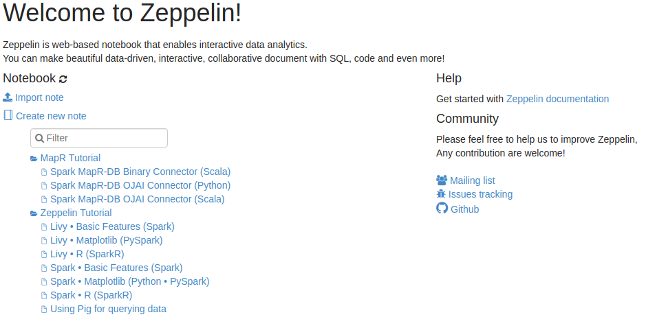

# Running Pig Scripts in Zeppelin

This section contains samples of an Apache Pig scripts that you can run in your Apache Zeppelin notebook.

[Apache Pig is](https://pig.apache.org/) a platform for analyzing large data sets that consists of a high-level language for expressing data analysis programs, coupled with infrastructure for evaluating these programs. The salient property of Pig programs is that their structure is amenable to substantial parallelization, which in turns enables them to handle very large data sets.

### Supported interpreter type

`%pig.script` (default Pig interpreter, so you can use `%pig`)

`%pig.script` is like the Pig grunt shell. Anything you can run in Pig grunt shell can be run in `%pig.script` interpreter, it is used for running Pig script where you don’t need to visualize the data, it is suitable for data munging.

`%pig.query`

`%pig.query` is a little different compared with `%pig.script`. It is used for exploratory data analysis via Pig latin where you can leverage Zeppelin’s visualization ability.

### Example

>How to perform the same actions using Spark SQL in Zeppelin look to the section about [Running Spark Jobs in Zeppelin](doc/tutorials/running-spark-jobs.md).


**pig - interpreter type**

<details> 
  <summary>Load and prepare data</summary>

```
%pig

bankText = load 'bank.csv' using PigStorage(';');
bank = foreach bankText generate $0 as age, $1 as job, $2 as marital, $3 as education, $5 as balance; 
bank = filter bank by age != '"age"';
bank = foreach bank generate (int)age, REPLACE(job,'"','') as job, REPLACE(marital, '"', '') as marital, (int)(REPLACE(balance, '"', '')) as balance;
store bank into 'clean_bank.csv' using PigStorage(';'); -- this statement is optional, it just show you that most of time %pig.script is used for data munging before querying the data. 
```

</details>

[]()


**pig.query - interpreter type**

<details> 
  <summary>Get the number of each age where age is less than 30</summary>

```
%pig.query

bank_data = filter bank by age < 30;
b = group bank_data by age;
foreach b generate group, COUNT($1);
```

</details>

[]()


<details> 
  <summary>The same as above, but use dynamic text form so that use can specify the variable maxAge in the textbox. Dynamic form is a very cool feature of Zeppelin, you can refer to this link) for details</summary>

```
%pig.query

bank_data = filter bank by age < ${maxAge=40};
b = group bank_data by age;
foreach b generate group, COUNT($1) as count;
```

</details>

[]()


<details> 
  <summary>Get the number of each age for specific marital type, also use the dynamic form here. User can choose the marital type in the dropdown list</summary>

```
%pig.query

bank_data = filter bank by marital=='${marital=single,single|divorced|married}';
b = group bank_data by age;
foreach b generate group, COUNT($1) as count;
```
</details>

[]()


Data is shared between `%pig` and `%pig.query`, so that you can do some common work in `%pig`, and do different kinds of query based on the data of `%pig`. Besides, we recommend you to specify alias explicitly so that the visualization can display the column name correctly. In the above example 2 and 3 of `%pig.query`, we name `COUNT($1) as count`. If you don't do this, then we will name it using position. E.g. in the above first example of `%pig.query`, we will use `col_1` in chart to represent `COUNT($1)`.


The notebook for this section you can find is the `Zeppelin Tutorial/Using Pig for querying data` folder. 

<details> 
  <summary>Using Pig for querying data</summary>



</details>

> If for some reason you can't find the default notebook for Pig. The also example located by path `notebooks/running-pig-scripts-in-zeppelin.json`


### About the dataset

```
Citation Request:
  This dataset is public available for research. The details are described in [Moro et al., 2011]. 
  Please include this citation if you plan to use this database:

  [Moro et al., 2011] S. Moro, R. Laureano and P. Cortez. Using Data Mining for Bank Direct Marketing: An Application of the CRISP-DM Methodology. 
  In P. Novais et al. (Eds.), Proceedings of the European Simulation and Modelling Conference - ESM'2011, pp. 117-121, Guimarães, Portugal, October, 2011. EUROSIS.

  Available at: [pdf] http://hdl.handle.net/1822/14838
                [bib] http://www3.dsi.uminho.pt/pcortez/bib/2011-esm-1.txt
```

> The other example of using Pig you can find in the official [MapR Data Science Refinery documentation](https://mapr.com/docs/61/Zeppelin/ZeppelinPig.html)