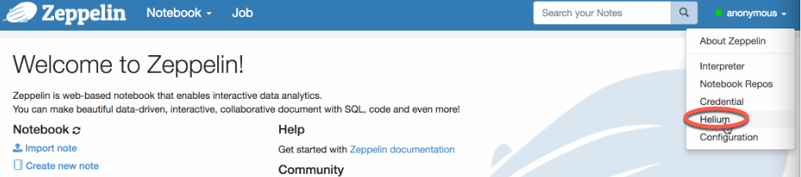
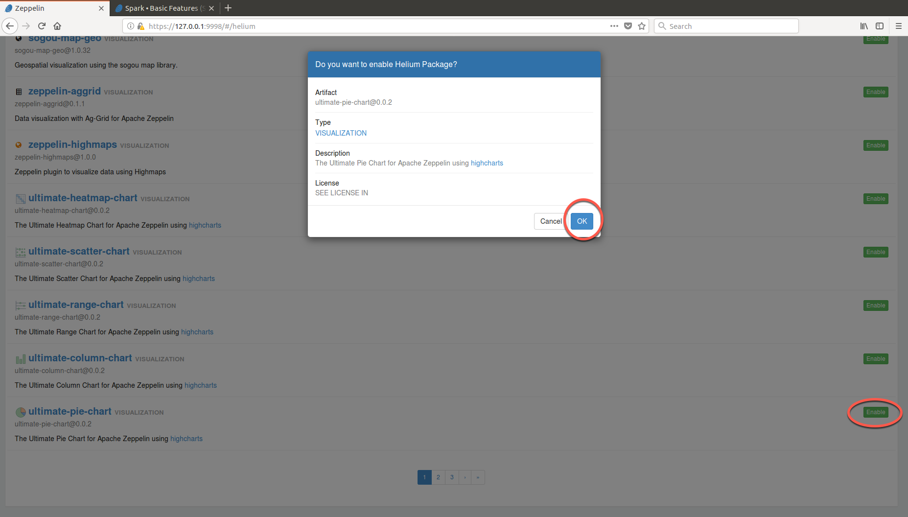
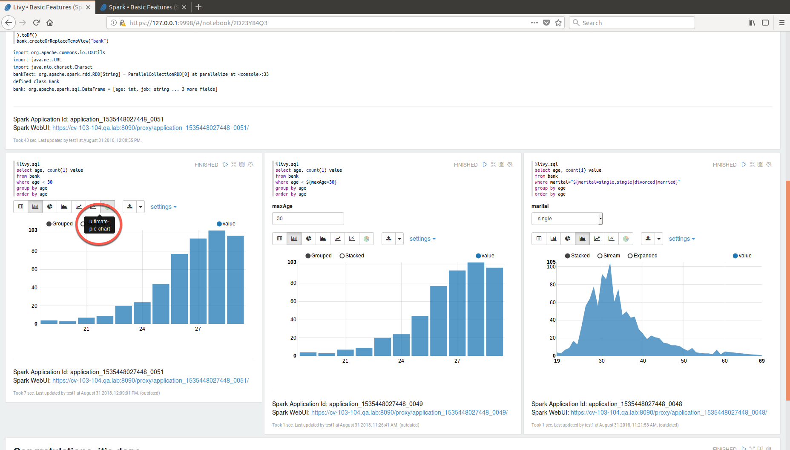

# Visualization in MapR Data Science Refinery

Apache Zeppelin Visualization is a pluggable package that can be loaded/unloaded on runtime through Helium framework in Zeppelin. A Visualization is a javascript npm package and user can use them just like any other built-in visualization in notebook.

Apache Zeppelin supports the Helium framework. Using visualization packages, you can view your data through area charts, bar charts, scatter charts, and other displays. To use a visualization package, you must enable it through the Helium repository browser in the Zeppelin UI. 
Like [Zeppelin interpreters](interpreters.md), Helium is automatically installed in your Zeppelin container.

> **Important:** The Apache Community provides and supports the visualization packages available through the Helium repository browser. MapR does not provide support for these packages.

Follow these steps to enable a package:

 
  
Open the Helium repository browser by selecting the Helium tab in the main menu of the Zeppelin UI:

 
  
Locate your package, click Enable, and then click OK in the popup window:

>The time it takes to enable a package depends on your internet connection speed.

 
  
After enabling the package and refreshing your browser to reload notebook content, you can use the package. The following shows output that uses the ultimate-pie-chart package:

#### Writing a new Visualization

There is an ability to create your own visualization, you need to create a js file and import `Visualization class` from `zeppelin-vis` package and extend the class. `zeppelin-tabledata` package provides some useful transformations, like pivot, you can use in your visualization.

Follow the link to get the instruction about [writing a new Visualization](https://zeppelin.apache.org/docs/0.8.0/development/helium/writing_visualization_basic.html#see-more)